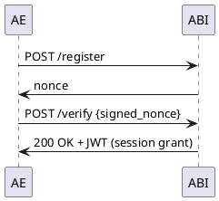
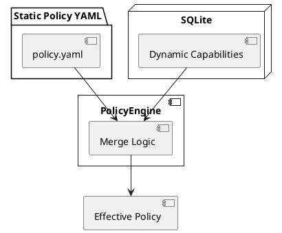
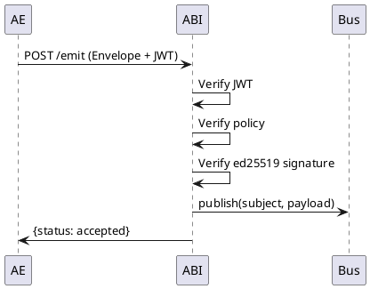

# AEGNIX ABI Service (Phase 3F → 3G)

The **AEGNIX Agent Bridge Interface (ABI) Service** is the trusted, cryptographically enforced admission and coordination layer for the **AEGNIX Swarm Mesh**.

It ensures that all **Atomic Experts (AEs)** entering the swarm are:

* **Authenticated** (dual-crypto admission + JWT session grant)
* **Authorized** (static + dynamic policy engine)
* **Trusted** (keyring-validated ed25519 public keys)
* **Audited** (full non-repudiation logs)
* **Coordinated** (EventBus + SSE real-time developer routing)

This service is the **central nervous system** of the AEGNIX platform, governing every message, every AE, every capability, and every trust relationship.

---

# 🔐 Core Responsibilities

## 1. **Admission (ed25519 Challenge-Response)**

* AE sends `/register`
* ABI returns a **nonce**
* AE signs nonce with its ed25519 private key
* ABI verifies signature, marks AE as **trusted**, stores key in keyring
* ABI issues a **JWT session token**



---

## 2. **Policy Enforcement (Static + Dynamic Merge)**

* Static `policy.yaml` defines hard boundaries
* AEs may optionally declare dynamic capabilities:

  * publishes: []
  * subscribes: []
* ABI merges both into a unified **Effective Policy**
* Hot-reload watcher updates policies in real time



---

## 3. **Verified Emission (/emit)**

Every AE message must:

* Include a **valid JWT** (`Bearer <grant>`)
* Be **signed** (ed25519) over the Envelope structure
* Pass **policy.can_publish()**
* Use a **trusted key** stored in keyring
* Match token `sub == producer`



---

# 📦 Directory Structure

```
abi_service/
├── main.py
├── bus.py
├── routes/
│   ├── admin.py
│   ├── audit.py
│   ├── emit.py
│   ├── register.py
│   ├── subscribe.py
│   └── capabilities.py
├── config/
│   └── policy.yaml
├── db/
│   └── abi_state.db
├── logs/
│   ├── abi_service.log
│   └── abi_audit.log
└── tests/
    ├── test_register_flow.py
    ├── test_emit_verified.py
    ├── test_policy_dynamic_merge.py
    └── test_subscribe_loopback.py
```

---

# 🔑 Key Modules

## **AdmissionService**

Dual-crypto admission flow:

* Nonce challenge
* ed25519 verification
* Keyring trust set
* JWT grant issued

## **Keyring (SQLite)**

Stores:

* AE public key
* status (untrusted → trusted → revoked)
* roles (future)
* prevents duplicates (Phase 3G+)

## **PolicyEngine**

Merges:

* **Static** policy from YAML
* **Dynamic** AE capabilities from SQLite

Enforces:

* can_publish(ae, subject)
* can_subscribe(ae, subject)

## **Capabilities Route (NEW Phase 3G)**

AEs may declare:

```json
{
  "publishes": ["fusion.topic"],
  "subscribes": ["roe.result"],
  "meta": {}
}
```

JWT-verified → stored → hot-reload updates Effective Policy.

## **SSE /subscribe**

Used for developer debugging & real-time mesh visibility.

## **Emit Route**

Full verification chain:

1. JWT
2. Envelope schema
3. Policy
4. Keyring trust
5. Signature
6. Dispatch to event bus
7. Local SSE fan-out

---

# 🚀 Test Suite

Run:

```bash
pytest -v -s --log-cli-level=DEBUG
```

Current status:

* **All tests passing** (Phase 3F + dynamic policy)

---

# 🔧 Environment

Set JWT secret:

```powershell
$env:ABI_JWT_SECRET="mydevsecret123"
```

DB defaults:

```
db/abi_state.db
```

Logs:

```
logs/abi_service.log
logs/abi_audit.log
```

---

# 📅 Roadmap

## ✅ Completed (Phase 3F)

* Verified /emit (JWT + policy + trust + signature)
* Dual-crypto admission
* Keyring integration
* EventBus + SSE loopback
* Hot reload for static policy & dynamic caps
* AE SDK integration

## 🟦 Phase 3G (CURRENT)

* AE-declared publishes/subscribes
* Dynamic merge into Effective Policy
* Unknown subject rejection
* Audit trails for capability change

## 🟧 Phase 4

* JWT refresh tokens
* Multi-transport mesh (Kafka, Pub/Sub)
* AE revocation propagation

## 🟪 Phase 5

* Federated ABIs
* Cross-domain trust
* Purpose Policy Overlay (Reflection Layer)

---

# 📘 Version

**ABI Service:** v0.3.8 — Phase 3F/3G Combined
**License:** Proprietary (Patent filings pending)
**Authors:** Invictus Insights R&D (Aegnix Framework)
